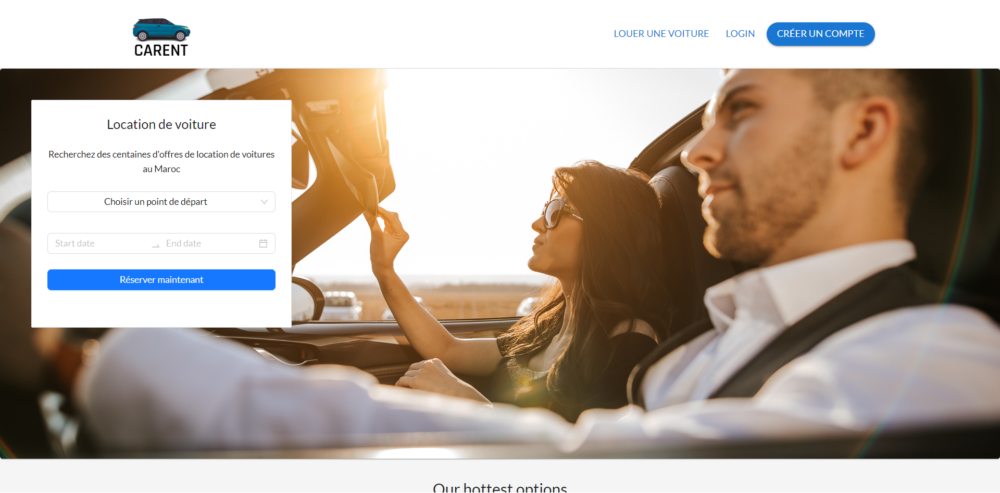
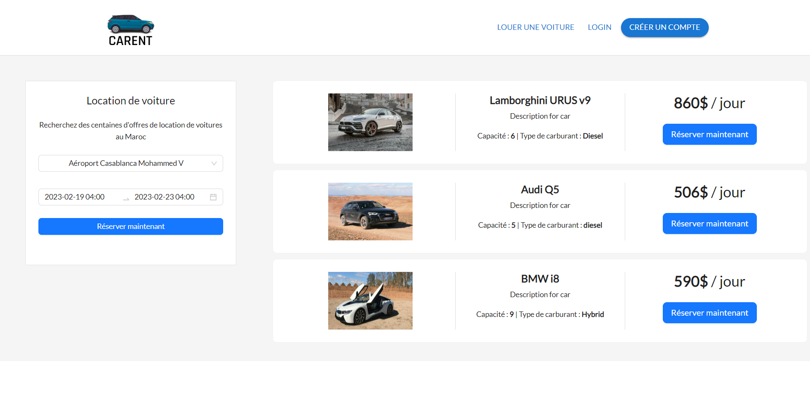
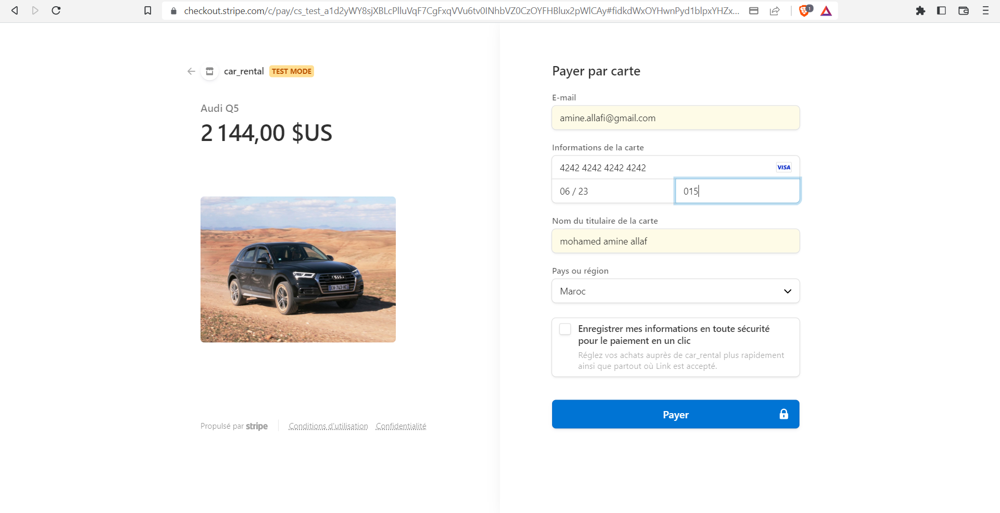
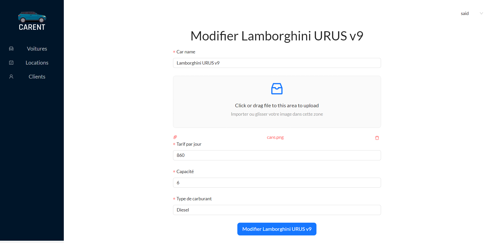
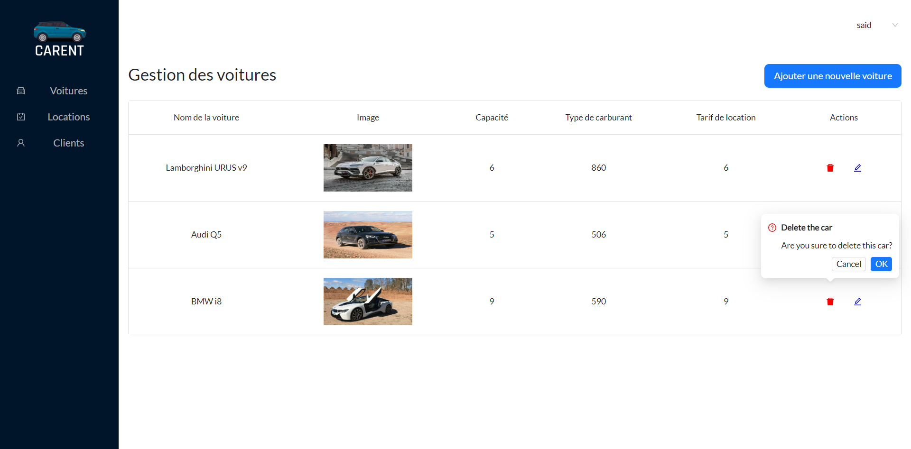
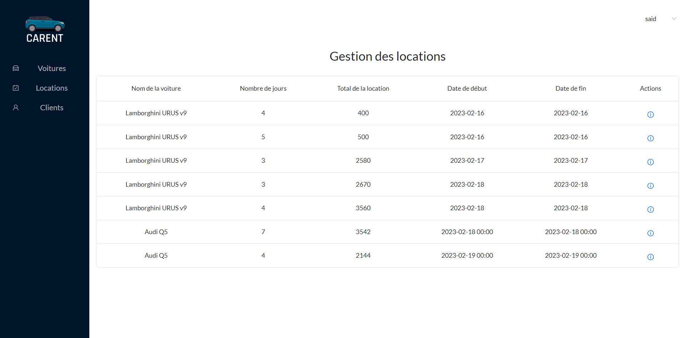

# Car Rental Application

## Description

This is a car rental application based on the MERN stack (MongoDB, ExpressJS, ReactJS, NodeJS) along with Stripe and Ant Design technologies. The application provides a comprehensive solution for managing car rentals and offers various modules, each catering to specific needs. 

The application is designed to enhance tourism management by streamlining the car rental process. With its user-friendly interface and efficient features, it aims to provide a seamless experience for both customers and administrators.

## Features

### Client Side

1. **Home**: The home page provides an overview of the car rental services, showcasing featured cars, special offers, and testimonials.

2. **Catalog**: The catalog page displays a wide range of available cars for rent. Users can filter and search for cars based on their preferences, such as model, price range, and location.

3. **Checking Details**: Users can view detailed information about a specific car, including its specifications, rental rates, availability, and customer reviews.

4. **Booking Process**: The application offers a smooth booking process. Users can select their desired car, choose rental dates, and review the total cost before proceeding.

5. **Secure Payment**: Integrated with Stripe, the application ensures secure online payments. Users can make payments using various methods, including credit cards, ensuring a hassle-free checkout experience.

6. **User Authentication**: Users can create accounts, log in, and manage their personal information. This feature enables users to save their preferences, track their bookings, and receive personalized recommendations.

### Admin Side

1. **Car Management**: The admin dashboard provides comprehensive tools for managing cars. Administrators can add new cars to the inventory, edit existing car details, and delete cars if necessary. 

   - **Add Car**: Administrators can add new cars to the inventory by providing details such as car model, specifications, rental rates, and availability.
   

   - **Edit Car**: Administrators can edit the details of existing cars in the inventory, including specifications, rental rates, and availability.
   

   - **Delete Car**: Administrators have the option to delete cars from the inventory if they are no longer available or required.
   

2. **Booking Management**: The application includes a dedicated module for handling bookings. Administrators can view and manage bookings, including approving or rejecting requests, managing rental dates, and tracking customer details.
   

## Installation

To install and run the Car Rental Application locally, follow these steps:

1. Clone the repository: `git clone https://github.com/your-repo-link.git`
2. Change to the project directory: `cd car-rental-application`
3. Install server-side dependencies: `npm install`
4. Change to the client directory: `cd client`
5. Install client-side dependencies: `npm install`
6. Return to the project directory: `cd ..`
7. Rename `.env.example` to `.env` and update the environment variables with your own configuration.
8. Start the application: `npm run dev`

Make sure to set up the required environment variables in the `.env` file before running the application.

